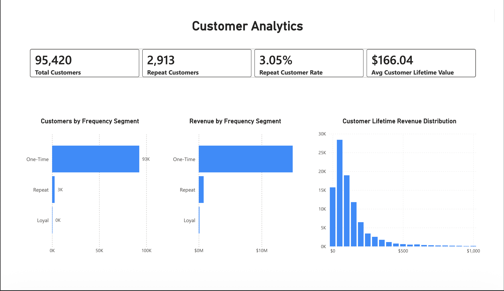

# E-Commerce Sales Intelligence Dashboard

An end-to-end analytics project that transforms ~100,000 raw e-commerce transaction records into an executive-ready Power BI dashboard, covering revenue performance, customer behavior, and operational efficiency for a Brazilian online marketplace.

**[Dashboard Preview] → [Python Notebooks] → [SQL Scripts] → [PBIX File]**

---

## Project Overview

This project simulates a real-world business intelligence workflow: raw, messy, multi-table transactional data is cleaned and modeled using Python and SQL, then engineered into analytical features and visualized in an interactive three-page Power BI dashboard designed for executive, customer, and operations stakeholders.

**Business questions answered:**
- What are our revenue trends, and which states and product categories drive the most value?
- Who are our most valuable customers, and how much of our revenue comes from repeat buyers?
- Where are operational bottlenecks — which sellers, states, or delivery patterns are underperforming?

**Dataset:** [Olist Brazilian E-Commerce Public Dataset](https://www.kaggle.com/datasets/olistbr/brazilian-ecommerce) — ~100,000 orders across customers, orders, order items, sellers, products, payments, reviews, geolocation, and product category translation tables.

**Time period covered:** September 2016 – August 2018

---

## Dashboard Highlights

The Power BI dashboard is organized into three pages, each built for a different stakeholder audience:

| Page | Audience | Key Metrics |
|---|---|---|
| Executive Overview | Leadership | Total Revenue ($15.8M), Total Orders (98,665), Total Customers (95,420), AOV ($160.58), Late Delivery Rate (6.77%), Avg Review Score (4.03) |
| Customer Analytics | Marketing / CX | Customer segmentation (One-Time, Repeat, Loyal), Customer Lifetime Value ($166.04 avg), Repeat Customer Rate (3.05%) |
| Operations and Performance | Ops / Logistics | Seller revenue rankings, late delivery rate by state (choropleth map), review score vs. delivery status |

Key design decisions included building a custom state-name mapping layer to resolve geocoding mismatches on the Brazil shape map, and using DAX-driven color saturation and tooltips to make the operations map interactive and self-explanatory for non-technical viewers.

### Executive Overview


### Customer Analytics



### Operations & Performance


---

## Tech Stack and Workflow

**Raw CSVs → Python (cleaning + feature engineering) → SQL/DuckDB (analytical modeling) → Power BI (visualization) → Business Insights**

### Python
Used as the primary data engineering and analytics layer to prepare the dataset before visualization.

**Libraries:**
- `pandas` — data cleaning, transformation, joins, feature engineering, exporting the analytical dataset
- `NumPy` — numerical operations
- `DuckDB` — SQL analytics executed directly on pandas DataFrames
- `Matplotlib` — exploratory visualizations during analysis

**Tasks performed:**
- Loaded and profiled multiple raw CSV files from the Olist dataset
- Cleaned missing values, duplicates, and inconsistent data
- Integrated multiple datasets into a unified analytical table
- Engineered business features, including:
  - Item Revenue
  - Freight Percentage
  - Late Delivery Flag
  - Order Month
  - Customer Lifetime Revenue
  - Customer Total Orders
  - Customer Frequency Segment (One-Time, Repeat, Loyal)
- Exported the final analytical table consumed by Power BI

### SQL
Written using DuckDB, an embedded analytical SQL engine, executed within Python notebooks to perform transformations that mirror how this work would be done inside an enterprise data warehouse.

**Tables joined:** Orders, Order Items, Customers, Sellers, Products, Payments, Reviews, Product Category Translation

**SQL techniques used:**
- CTEs (`WITH` clauses)
- Aggregate functions and `GROUP BY`
- `CASE` statements for segmentation logic
- Window and ranking functions

**Analyses built in SQL:**
- Monthly revenue trends
- Customer Lifetime Value (CLV)
- Customer frequency segmentation
- Repeat customer rate
- Seller performance rankings
- Top product categories
- Pareto revenue analysis (80/20 revenue concentration)
- Late delivery analysis
- Review score analysis

### Power BI
The final analytical table was loaded into Power BI Desktop, where visuals, DAX measures, and a custom Brazil shape map were built to deliver an interactive, filterable dashboard across three report pages.


## Repository Structure

The repository is organized as an end-to-end analytics project following a typical analytics workflow.

```text
ecommerce-sales-intelligence/
│
├── data/
│   ├── raw/                          # Original Olist CSV files
│   └── processed/                    # Cleaned, feature-engineered analytical table
│
├── notebooks/
│   ├── 01_data_profiling.ipynb
│   ├── 02_data_cleaning.ipynb
│   └── 03_exploratory_data_analysis.ipynb
│
├── sql/
│   ├── customer_segmentation.sql     # Frequency segmentation, CLV, repeat rate
│   ├── seller_performance.sql        # Seller revenue rankings
│   ├── pareto_revenue_analysis.sql   # 80/20 revenue concentration
│   ├── late_delivery_analysis.sql    # Delivery performance by state
│   └── monthly_revenue_trends.sql    # Time-series revenue aggregation
│
├── powerbi/
│   ├── ecommerce_sales_dashboard.pbix
│   └── dashboard_screenshots/
│
├── README.md
└── requirements.txt
```

> **Note:** Core SQL logic is kept in standalone `.sql` files (in addition to being embedded in the notebooks) so the analytical approach can be reviewed independently of the Python pipeline.

## How to Reproduce

1. Clone the repository and install dependencies: `pip install -r requirements.txt`
2. Download the [Olist dataset](https://www.kaggle.com/datasets/olistbr/brazilian-ecommerce) into `data/raw/`
3. Run notebooks in order: `01_data_profiling.ipynb` → `02_data_cleaning.ipynb` → `03_exploratory_data_analysis.ipynb`
4. The final analytical table exports to `data/processed/`
5. Open `powerbi/ecommerce_sales_dashboard.pbix` in Power BI Desktop and refresh the data source

---

## Key Business Insights

- **Revenue concentration:** A small number of states (São Paulo, Rio de Janeiro, Minas Gerais) drive a disproportionate share of total revenue, consistent with Pareto-style concentration.
- **Customer retention gap:** Only 3.05% of customers are repeat buyers, despite loyal/repeat segments generating meaningfully higher lifetime value — pointing to a clear retention opportunity.
- **Delivery-satisfaction link:** Orders delivered late show a measurable drop in average review score, reinforcing delivery performance as a lever for customer satisfaction, not just logistics cost.

---

## Skills Demonstrated

Python • SQL • DuckDB • Pandas • NumPy • Power BI • DAX • Data Cleaning • ETL • Data Modeling • Business Intelligence • Data Visualization • Feature Engineering • Customer Analytics • Sales Analytics • KPI Development • Window Functions • CTEs

## Author

Built as an end-to-end analytics portfolio project demonstrating data engineering, analytical SQL, feature engineering, business intelligence, and executive dashboard design. The project simulates the workflow commonly used by enterprise analytics teams to transform raw transactional data into decision-support insights.
